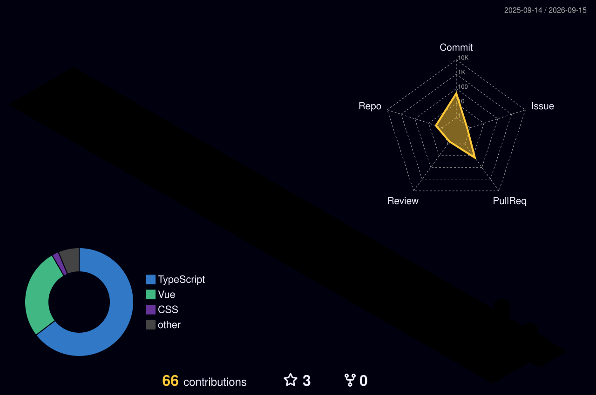

## 👨‍💻 About Me
🎯 Fullstack developer focused on building modern, accessible, and high-performance interfaces.   
🧱 I work daily with React, Next.js, React Native, and NestJS.    
⚙️ I have solid knowledge of Tailwind, Material UI, REST, GraphQL, Prisma and Docker.    
🚀 Currently working as a Fullstack Developer, also studying Java and Spring Boot to expand my backend skills.    
💡 I'm always looking for real-world challenges to apply architecture, best practices, and product thinking.   

---

## ⚙️ Technologies & Tools

---

## 📫 How to Reach Me

---

## 📈 GitHub Stats

---

✨ Always striving to grow — both as a developer and as a person. Let's go! 🚀

